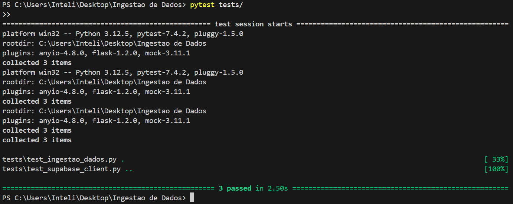
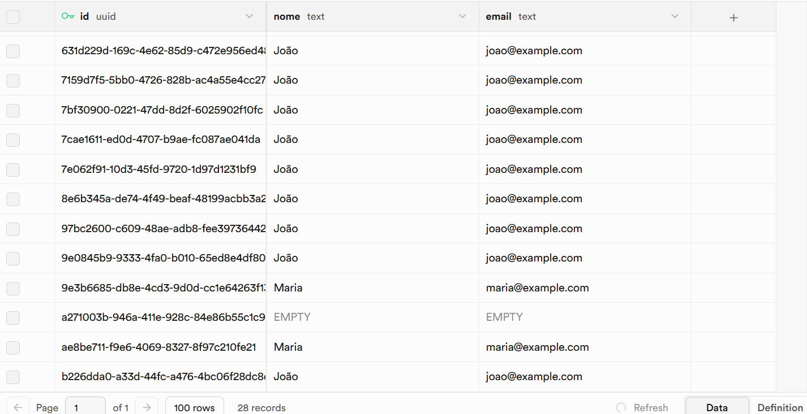
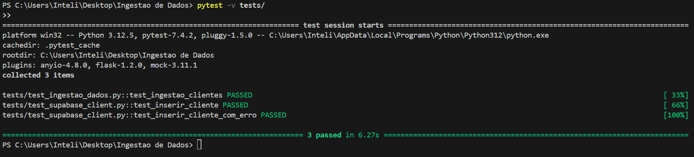

## Configuração e Execução

### 1. Clonando o Repositório
Primeiro, clone o repositório para sua máquina local:
```sh
git clone <URL_DO_REPOSITORIO>
cd Ingestao-de-Dados
```

### 2. Criando e Ativando o Ambiente Virtual
Em seguida, crie e ative o ambiente virtual:
```sh
python -m venv venv
source venv/bin/activate  # No Windows, use venv\Scripts\activate
```

Depois, instale as dependências:
```sh
pip install -r requirements.txt
```

### 3. Configurando as Variáveis de Ambiente
Crie um arquivo `.env` na raiz do projeto e adicione as seguintes variáveis:
```
SUPABASE_URL=<sua-url-do-supabase>
SUPABASE_API_KEY=<sua-chave-de-api>
```

### 4. Executando a Ingestão de Dados
Para rodar o processo de ingestão de dados, execute:
```sh
python -m ingestao.ingestao_dados
```

---

## Execução com Docker

### 1. Criando a Imagem Docker
Se preferir rodar a ingestão com Docker, crie a imagem:
```sh
docker build -t ingestao-dados .
```

### 2. Rodando o Container
Depois, rode o container com as variáveis de ambiente:
```sh
docker run --env-file .env ingestao-dados
```

---

## Execução de Testes

Para rodar os testes automatizados, use o comando:
```sh
pytest tests/
```

A saída esperada será similar a esta:



---

## Supabase

Aqui está a configuração do Supabase para referência:



#### Se quiser ver os detalhes:

pytest -v tests/

